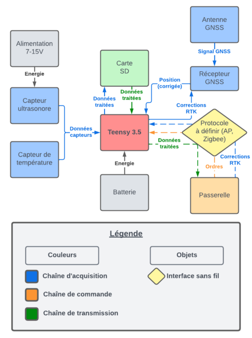
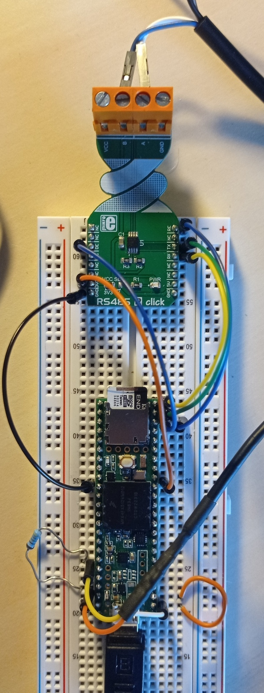
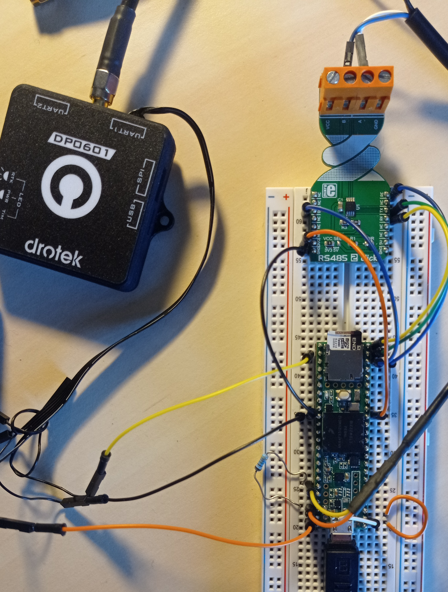

Satellite Cyclopée
==================

## Description
Le satellite Cyclopée a été développé pour les chrcheurs du laboratoire LIENSs à La Rochelle pour réaliser des mesures de niveau marin, à bord d'embarcations et à bas coût.<br>
Il est équipé un altimètre ultrasonore permettant de mesurer la distance le séparant d'une surface (sol, eau), un capteur de température, externe au distancemètre et un récepteur GNSS donnant l'heure et sa position. Le récepteur GNSS peut être quelconque du moment qu'il transmet les trames NMEA `$GPGGA` et `$GPRMC`.<br>
Ce dispositif horodate, géoréférence et stocke localement (carte SD) les mesures de distance à la surface étudiée. Si associé à une passerelle, il peut également lui transmettre ses mesures pour stockage en base de données.



## Cahier des charges
Pour dresser le cahier des charges, nous avons réuni les chercheurs du LIENSs afin de relever les cas d'utilisation et d'en extraire des contraintes techniques auxquelles devra répondre le système. Les scénari relevés concernent principalement des fréquences de meusre élévées sur des périodes de déploiement assez courtes, ou en présence d'alimentation externe; et des fréquences plus douces mais sur des périodes de déploiement plus longues :

|Scénario|Fréquence d'acquisition|Autonomie|Précision|Mesurandes secondaires|Remarques|
|--------|-----------------------|---------|---------|--------------------------|---------|
|Mesure continue|10Hz|1 mois à bord d'un navire (alimentation externe)|1cm (1mm?)|Température<br>Pression atmosphérique (0,1hPa)||
|Mesure de référence|?|Alimentation externe|1mm||Toit du LIENSs<br>Quantification des dérives|
|Mesure relative de niveau d'eau en marais|~15min|?|<1cm||
|Mesure de marées/vagues (bouée?)|Burst toutes les 10-15min|10-20 jours|1cm (1mm?)|||
|Transatlantique|1Hz ou ~30min|Le + possible<br>Recharge solaire|~1m|||

La réalisation d'une première version du satllelite à partir d'un Teensy 3.5 est en cours. Elle vise à déterminer les vérous technologiques et tentera d'implémenter les fonctionnalités suivantes :

- Facilité de déploiement;
- Mesures de distance/tempérture :
	+ Mesurer à intervalles réguliers et configurables.
	+ Présenter un mode burst (échantillons de mesures proches).
	+ Se rapprocher le plus possible des 10Hz.
- Logs de données :
	+ Horodater les mesures avec l'heure GNSS.
	+ Géoréférencer les mesures avec la position GNSS.
	+ Stockage interne des logs de données;
	+ Segmentation des fichiers de log (en prévention de l'arrêt involontaire du système);
	+ Logs au format `.csv`.
	+ Interrrompre/reprendre les logs.
- GNSS :
	+ Récupérer l'heure GNSS.
	+ Récupérer la position GNSS (longitude, latitude, altitude).
- Pouvoir utiliser des corrections RTK.
- Autonomie :
	+ Alimentation externe & sur batterie;
	+ Possibilité de recharge solaire;
- Monitoring :
	+ Envoi des données à la passerelle;
- Mesurandes secondaires :
	+ Pouvoir accueillir une station pression/température.
- Résister à l'environnement marin.

## Matériel
- Teensy 3.5 (ou ESP32 Joy It);
- Antenne GNSS multi-bandes IP66;
- Récpeteur GNSS transmettant les trames NMEA `$GPGGA` et `$GPRMC`;
- Mikroe RS485 click 2;
- Capteur ultrasonore DFRobot URM14;
- Sonde DallasTemperature DS18B20;
- Résistance pullup 4.7kOhms;
- Alimentation (URM14) 7-15V;
- Alimentation (Board) 5 ou 3.3V.

## Avancement
La réalisation d'une première version du satllelite à partir d'un Teensy 3.5 est en cours. Elle vise à déterminer les verrous technologiques. Pour le moment, deux loggers nus mais quasi fonctionnels ont été assemblés. Ils enregistrent tous deux les mesures localement sur une carte SD. Les codes sources sont disponibles dans les dossiers ```GNSS_logger``` et ```clock_logger```.<br>
Le dossier ```GNSS_logger``` contient le nécéssaire pour accompagner la réalisation d'un logger utilisant le temps et la position GNSS pour horodater et géoréférencer les mesures.<br>
Le dossier ```clock_logger``` contient le nécéssaire pour accompagner la réalisation d'un logger utilisant l'horloge interne du Teensy 3.5 pour horodater les mesures.

## Verrous technologiques identifiés
Les principales difficultés rencontrées jusqu'ici concernent la fréquence d'acquisition. Atteindre les 10Hz avec des capteurs low cost n'est pas si simple car ils peuvent avoir besoin de temps convertir leur mesure en valeur numérique. C'est le cas du DS18B20 qui même avec une résolution minimale de 9 bits (0.5°C) nécéssite une temps de conversion de 93.75ms soit quasiment 0.1s (10Hz). Nous n'avons pas trouvé de solution pour éviter ce temps de convertion.<br>
A noter que pour horodater et géoréférencer les mesures acquises à 10Hz, le récepteur GNNS doit également pouvoir générer des données à cette fréquence.

<!--- 


--->

## Tests unitaires
Le dossier `unit_tests` de ce répertoire propose des exemples de programmes permettant de tester le matériel, notamment le capteur ultrasonore, la sonde de température, le lecteur SD et les récepteurs GNSS.