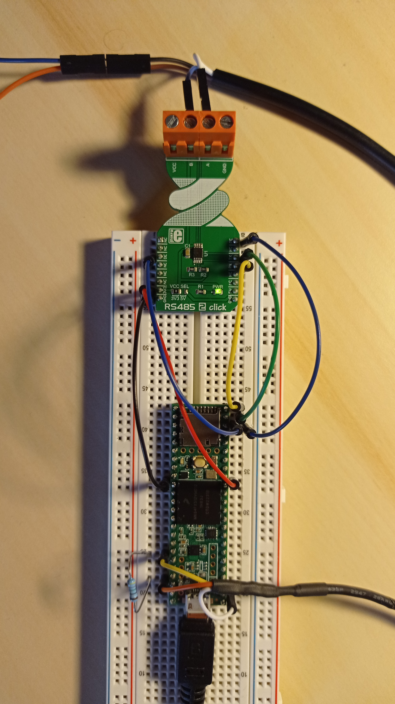

Test de compensation de la distance avec une température externe
================================================================

## En bref
Ce programme permet de tester la compensation de la distance mesurée par un capteur ultrasonore URM14 avec une température externe provenant d'une sonde DS18B20.

## Matériel
- Teensy 3.5 ou carte ESP32;
- Capteur ultrasonore URM14;
- Interface Mikroe RS485 click 2;
- Alimentation 7-15V (URM14);
- Sonde de température DS18B20;
- Résistance pull up 4.7kOhms.

## Bibliothèque
- `ModbusMaster`;
- `OneWire`;
- `DallasTemperature`.

## Inspiration
Ce programme est inspiré des tests unitaires précédents `temperature_test` et `distance_test`.

## Montages
Deux montages utilisant un Teensy 3.5 et une carte ESP32 Joy-It ont été testés.

## Ports
Pour ces deux montages, le port de communication `Serial` est utilisé pour le debug via USB (moniteur série de l'IDE Arduino) à 115200 baud. 

Pour faciliter le montage, les ports de communication sur les bus de données sont différents :

- Le Teensy utilisera le port `Serial4` pour communiquer sur le bus de données Modbus à la vitesse de communication du capteur URM14. Il utilisera l'entrée digitale **30** pour communiquer en OneWire avec la sonde DS18B20.
- L'ESP32 utilisera le port `Serial1` pour communiquer sur le bus de données Modbus à la vitesse de communication du capteur URM14. **D2** (TX) et **D4** (RX) sont les pins définies dans le programme pour ce port. Il utilisera l'entrée digitale **D18** pour communiquer en OneWire avec la sonde DS18B20.

## Branchements

|Teensy|ESP32|Interface RS485|
|------|-----|---------------|
|TX4|D2|RX|
|RX4|D4|TX|
|30|D5|DE & RE|
|3V3|3V3|3V3|
|GND|GND|GND|

Le capteur URM14 doit être alimenté entre 7 et 15V !

|URM14|Interface RS485|Alimentation 7-15V|
|---------------|-----|------------------|
|Fil Blanc|A||
|Fil Bleu|B|
|Fil marron||Borne +|
|Fil noir||Borne -|

|Teensy|ESP32|DS18B20|
|------|-----|-------|
|3V3|3V3|Fil Orange|
|GND|GND|Fil Blanc|
|30|D18|Fil Jaune|

