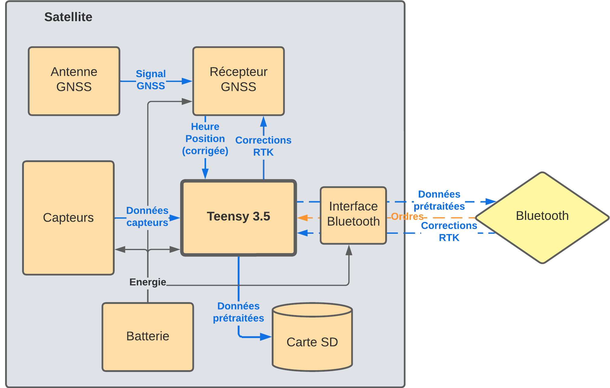
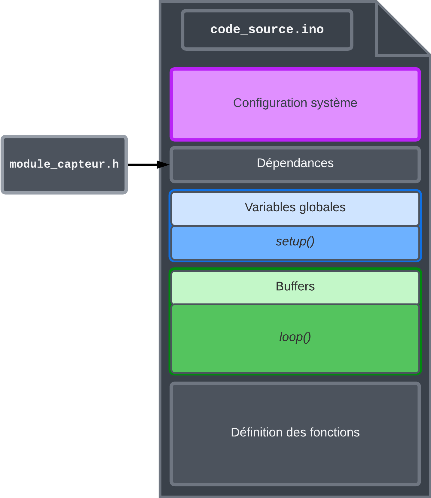
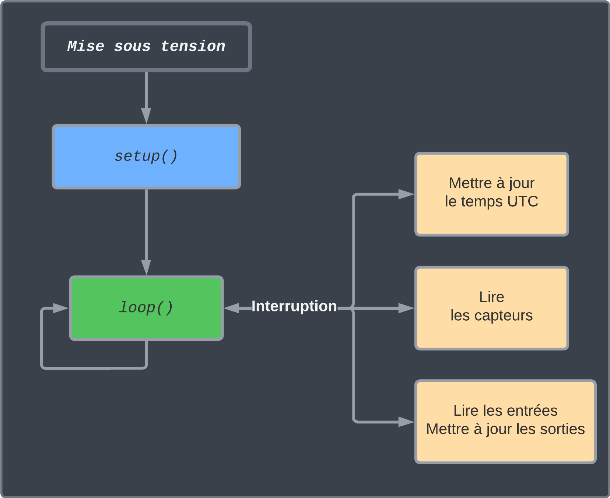
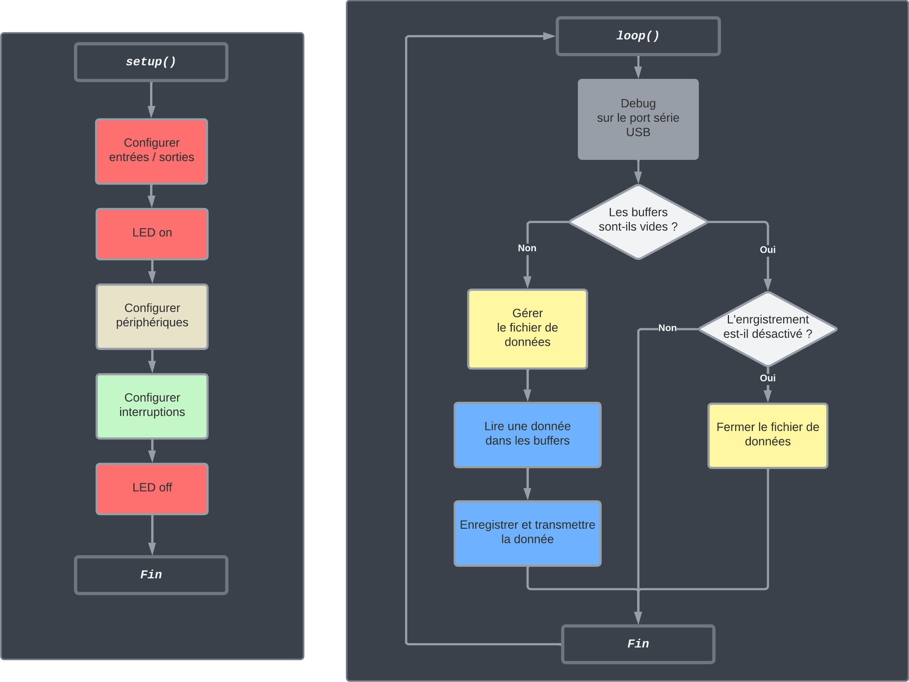
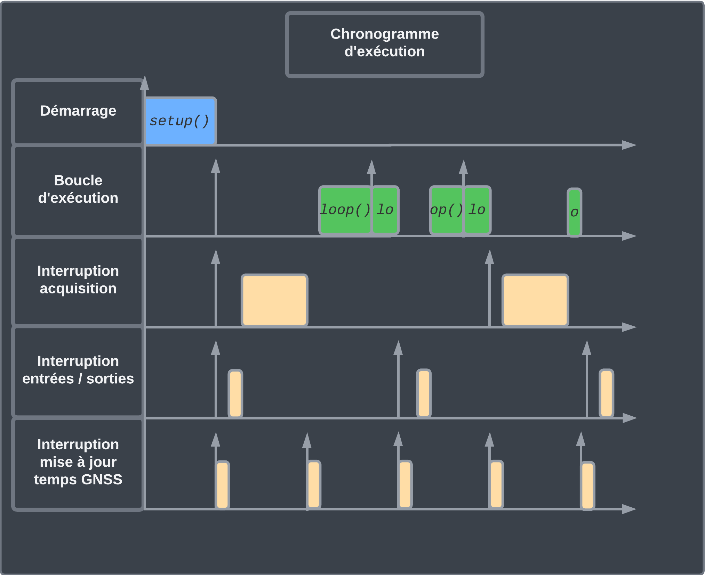
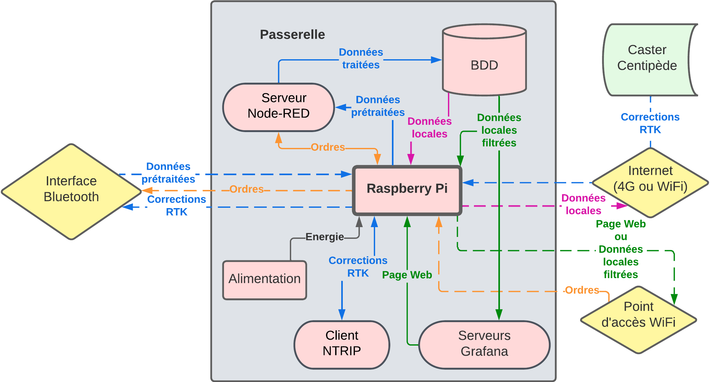

# Architecture détaillée
## Les satellites

Les satellites sont à la base de la chaîne d’acquisition. Ils constituent des solutions particulières, adaptées aux besoins des projets de recherche, pour générer des données. 
Leur rôle est d’enregistrer des mesures de grandeurs physiques, et de les communiquer à la passerelle. À noter qu’ils peuvent très bien fonctionner de manière isolée, sans cette dernière, et simplement enregister les données localement.

Malgré le nombre de projets rescencés (cf. [Cahier des Charges Foncionnel](docs/cfunctional_specspdf)), nous avons pu regrouper les mesurandes apparaissant le plus souvent ensemble, et imaginer un nombre restreint de satellites. Pour le moment, Ils sont au nombre de trois : 

- Le satellite Cyclopée, chargé de la mesure de niveau marin;
- Deux versions d'une valise multicapteurs, chargées de relever les caractéristiques de l’eau.

#### Architecture et fonctionnement

###### Archtecture physique

Les satellites ont été conçus sur une base commune. Ils utilisent donc globalement les mêmes composants, et fonctionnent sur le même principe.

Le diagramme des flux suivant représente l'architecture des satellites. Le recepteur et l'antenne GNSS, ainsi que les capteurs changent en fonction du satellite désiré.



###### Architecture et fonctionnement logiciel

L’architecture logicielle repose sur celle d’un projet Arduino. Elle s’articule autour d’une fonction `setup()`, exécutée une seule fois au début du programme, et d’une boucle d’exécution `loop()`, appelée en continu et consitutant la base du programme. A ces fonctions, ont été ajoutées des interruptions périodiques permettant de répondre aux contraintes de temps réel des satellites. Les diagrammes suivant illustre l'organisation du fichier source.



L’architecture du programme étant maintenant fixée, nous allons pouvoir nous intéresser de plus près aux différentes tâches constituant le programme. Elles sont au nombre de cinq :

- Le démarrage;
- l’enregistrement et la transmission des données;
- La lecture des capteurs;
- La lecture/écriture des entrées/sorties;
- La mise à jour du temps UTC.

Le démarrage est réalisé par la fonction `setup() `d’Arduino. Elle permet de configurer le Teensy pour communiquer avec les périphériques du système. Les interruptions représentant les tâches liées aux capteurs, entrées/sorties et module GNSS, y sont configurées.

L’enregistrement et la transmission des données sont gérés par la fonction `loop()`, faisant office d’état de repos (idle) du système. La lecture des capteurs ne s’éffectuant pas dans cette boucle, des buffers ont été utilisés pour stocker temporairement les données à enregistrer. La fonction `loop()` se contente alors de lire les données des buffers, de gérer le fichier d’enregistrement, et d’y enregistrer les données. Cet état de repos est interrompu par les taches d’acquisition des périphériques, et entrées/sorties. Dans leur ordre de priorité, des interruptions ont donc été définies pour la lecture du temps UTC, la lecture/écriture des entrées/sorties, et la lecture des
capteurs.

Le module GNSS fournit au Teensy des trames NMEA contenant l’heure UTC et la position du système, en continu, à une fréquence choisie. Afin de correctement analyser ces trames, la bibliothèque utilisée nécéssite une fréquence de lecture du port série associé au module GNSS élevée (1kHz). L’interruption chargée de la lecture du port série a donc été définie comme prioritaire. 

Le rafraîchissement des sorties et la lecture des entrées ont volontairement été disociés de la boucle d’exécution afin de minimiser sa durée. De plus, l’interruption de lecture des capteurs a un temps d’exécution non négligeable, dû au délai de réponse des capteurs. Il peut arriver qu’à fréquence d’acquisition trop élevée, les appels à la lecture des capteurs s’accumulent. Le Teensy est alors trop occupé à résoudre ces appels et n’exécute jamais la fonction loop(). Le remède a été de définir une interruption prioritaire sur l’état de repos et la lecture des capteurs, permettant ainsi à l’utilisateur d’interagir avec le satellite malgré ce bloquage.

La lecture des capteurs a également été définie comme interruption périodique, afin de respecter précisément la fréquence d’acquisition. Sa durée d’exécution est conséquente, car elle dépend du temps de réponse des capteurs. Les données acquises sont temporairement stockées dans des buffers, servant la file d’attente pour enregistrement des données.

Les figures suivantes schématisent le déroulement du programme, et le chronogramme illsutre les priorités et la pile d’exécution des tâches.





##### Le satellite Cyclopée
La détermination du niveau marin par Cyclopée consiste en la mesure du tirant d’air le séparant de la surface de l’eau, et du calcul précis de sa position GNSS. Ce principe développé et validé par [Chupin et al. (2020)](https://doi.org/10.3390/rs12162656) permet, à partir des données recueillies de calculer le niveau marin.


##### La valise multicapteurs
La valise multicapteurs est destinée à la mesure de plusieurs grandeurs. Elle embarquera donc différentes sondes. Pour répondre aux besoins du laboratoire (cf. [Cahier des Charges Fonctionnel](docs/functional_specs.pdf)) de la documentation), elle a principalement été développée pour le suivi de la qualité de l’eau.

Deux versions ont été réalisées :

- Une plus bon marché, chargée des caractéristiques simples comme la température, la turbidité et la salinité; 
- Une plus onéreuse, prévue pour les grandeurs plus complexes comme les concentrations en oxygène, chlorophylle et le pH.

Le système se veut modulaire et assez flexible pour accepter des versions modifiées de ces satellites, ou bien de nouveaux n’ayant pas encore été imaginés.

Les carartéristques et fonctionnement des satellites sont respectivement abordés plus en détail dans le [Cahier des Charges Fonctionnel](docs/functional_specs.pdf) de la documentation, et dans leurs dossiers repectif terminant par ```..._sat```.

### La passerelle
La passerelle, de son côté, constitue l’élément central du système. C’est elle qui réalise le pont entre les données et les utilisateurs finaux. Elle enregistre les données des satellites en base de données, d’abord localement, puis les décharge sur un serveur distant connecté à internet, pour les rendre accessibles à la communauté de chercheurs.



### Architecture système détaillée

Le diagramme de flux de la figure suivante représente l’architecture du système satellites / passerelle. 


