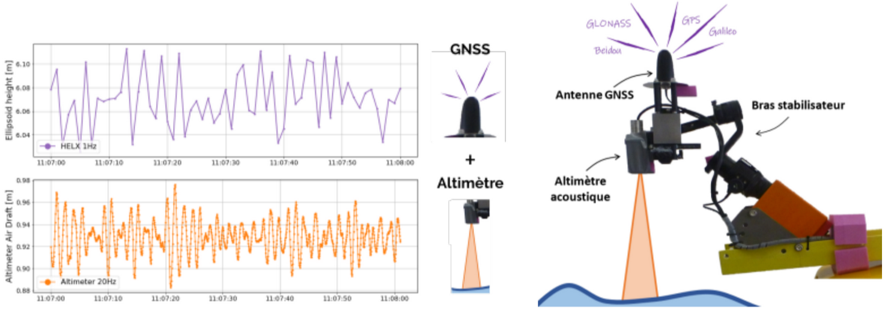
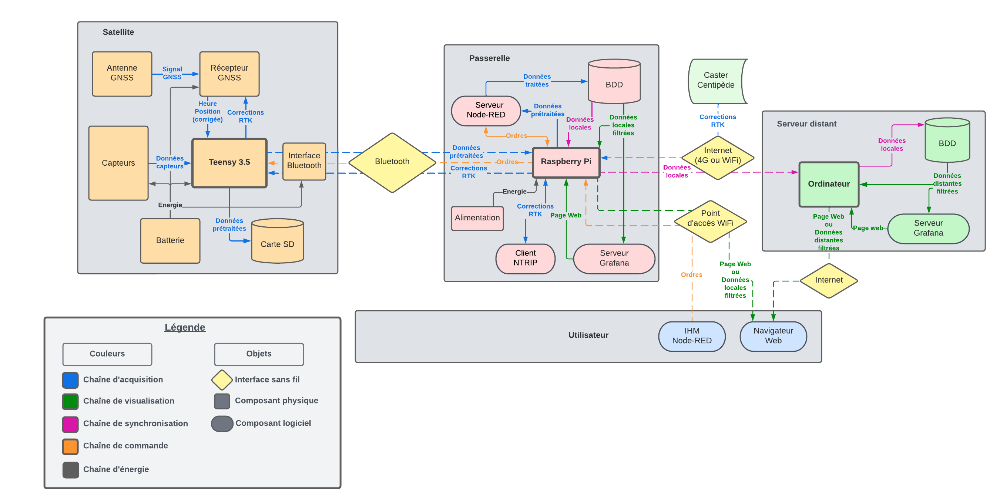

# MultiProbeCase

## Science Participative: vers un littoral connecté

Depuis une dizaine d’années, de nombreuses associations mettent en place des projets de sciences participatives. Le développement récent de capteurs à faibles coûts a permis le développement de nombreux projets de « kits de mesure » comme [SensoOcean](https://www.astrolabe-expeditions.org/programme-de-sciences/sensocean/), [SETIER Datalogger](https://gitlab.irstea.fr/reversaal/setier_datalogger), et [OceanIsOpen](https://github.com/TamataOcean/OceanIsOpen). Ces projets sont comparés dans la [synthèse de projets existants](docs/state_of_the_art.pdf), disponible dans la documentation.

Cette multiplication des points d’observations est une réelle opportunité pour mieux comprendre les phénomènes océaniques et littoraux, tout en limitant les coûts financiers et environnementaux associées à des missions océanographiques. Les laboratoires scientifiques se sont récemment saisis de cette thématique, et les journées [Ti’Low COAST](http://ti-low-coast.fr/?PagePrincipale) organisées en septembre à Brest ont permis de mettre en valeurs de nombreuses initiatives « low cost » portées par des laboratoires en France.

Dans le cadre local, les Pertuis Rochelais sont une zone d’étude privilégiée du laboratoire [LIENSs](https://lienss.univ-larochelle.fr/). Les chercheurs y étudient les caractéristiques physico-chimiques de l’eau et leur évolution, la dynamique sédimentaire ou le niveau de la mer... Une meilleure compréhension de cet environnement côtier variable nécessite plus de données, et actuellement une bouée scientifique permanente est en préparation.

Les voiliers, les navires à passagers ou les bateaux de courses ont accès à des zones différentes de celles explorées par nos navires de recherches. Intégrer un moyen de mesures autonome sur ces embarcations permettrait d’apporter des éléments de compréhension des dynamiques littorales en augmentant la résolution spatiale et temporelle des mesures actuelles.

L’objectif du projet « sciences participatives » est de développer un système de kits de mesure, dont le coût et la légèreté rendent possible son installation sur des navires d’opportunité. Ce prototype devrait intégrer des capteurs environnementaux (salinité, température, turbidité, O²) ainsi qu’un dispositif de mesure du niveau de la mer basé sur le système GNSS [Centipède](https://docs.centipede.fr/).


## Objectifs du projet

Ce projet s’articule autour de quatre thématiques principales :

 - La production de données environnementales dans les pertuis Rochelais; 
 - La mise à disposition et l’accès aux données; 
 - La maîtrise des coûts de mesure; 
 - L’évaluation des capteurs « low cost » du marché.

L’objectif principal du projet réside dans l’augmentation de la résolution saptiale et temporelle des données environnementales des pertuis. Pour cela, nous avons premièrement souhaité faciliter la prise de mesures sur le terrain en développant des kits de mesure pratiques et autonomes à embarquer à bord de bâteaux. Nous avons également eu recours à la science participative pour étendre les zones de mesures et augmenter la portée et la fréquence d’acquisition. 
Le système final sera destiné aux chercheurs, déjà familiers avec la prise de mesures, ainsi qu’à toute personne ou organisme n’ayant pas de connaissances ou compétences préalables, mais souhaitant tout de même participer à la collecte de données. Dans l’idéal, nous souhaiterions équiper un maximum d’embarcations. Les navires à passagers, traversant la zone plusieurs fois par jour, seront les principales cibles. Une fois le système en place, nous nous tournerons vers les plaisanciers et régatiers.

Une attention particulière est accordée à la mise à disposition et à l’accès aux données. Les principaux freins à celles-ci étant le transfert laborieux des mesures réalisées sur le terrain en base de données et la multiplication des plateformes de sockage en ligne. L’objectif sera donc d’automatiser le stockage des données et de les rendre facilement accèssibles.
La maîtrise des coûts de mesure participera également à faciliter la prise de mesures. Des équipements moins chers, mais qualifiés en précision, rebuteront moins les chercheurs et particuliers à l’achat et à l’utilisation dans des conditions difficiles.

La maîtrise des coûts passe par le développement de kits de mesure bien dimensionnés aux besoins. Une évaluation des capteurs « low cost » intéressants du marché est donc nécessaire, le but étant de déterminer leurs caratéristiques et tester leurs limites, afin de leur donner un contexte d’utilisation.

## Architecture système

Afin de répondre aux objectifs évoqués ci-dessus, un système de kits de mesure modulaire a été imaginé. Chaque kit a pour missions l'enregistrement de mesures de grandeurs définies, ainsi que le stockage local des données, afin de sécuriser l’acquisition. Ils sont également chargés de les transmettre en temps réel à une passerelle, s'occupant de centraliser leurs données et de les mettre à disposition. Par analogie avec les planètes et leurs satellites naturels, les kits de mesure ont été surnommés « satellites », puisqu’ils gravitent en quelque sorte autour de la passerelle.

Pour le moment, trois ont été développés : 

- Le satellite Cyclopée, chargé de la mesure de niveau marin;
- Deux versions d'une valise multicapteurs, chargées de relever les caractéristiques de l’eau.

Leur carartéristques et fonctionnement sont abordées plus en détail dans leurs dossiers repectif terminant par ```..._sat```, ou dans le [Cahier des Charges Fonctionnel](docs/cdcf.pdf) de la documentation.

#### Le satellite Cyclopée
La détermination du niveau marin par Cyclopée consiste en la mesure du tirant d’air le séparant de la surface de l’eau, et du calcul de sa position GNSS. Ce principe développé et validé par [Chupin et al. (2020)](https://doi.org/10.3390/rs12162656) permet, à partir des données recueillies de calculer le niveau marin.



#### La valise multicapteurs
La valise multicapteurs est destinée à la mesure de plusieurs grandeurs. Elle embarquera donc différentes sondes. Pour répondre aux besoins du laboratoire (cf. [Cahier des Charges Fonctionnel](docs/cdcf.pdf) de la documentation), elle a principalement été développée pour le suivi de la qualité de l’eau.

Deux versions ont été réalisées :

- Une plus bon marché, chargée des caractéristiques simples comme la température, la turbidité et la salinité; 
- Une plus onéreuse, prévue pour les grandeurs plus complexes comme les concentrations en oxygène, chlorophylle et le pH.

Le système se veut modulaire et assez flexible pour accepter des versions modifiées de ces satellites, ou bien de nouveaux n’ayant pas encore été imaginés.

#### La passerelle
La passerelle, de son côté, constitue l’élément central du système. C’est elle qui réalise le pont entre les données et les utilisateurs finaux. Elle enregistre les données des satellites en base de données, d’abord localement, puis les décharge sur un serveur distant connecté à internet, pour les rendre accessibles à la communauté de chercheurs.

Le diagramme de flux de la figure suivante représente l’architecture du système satellites / passerelle. 



-------------------------------------------------------
