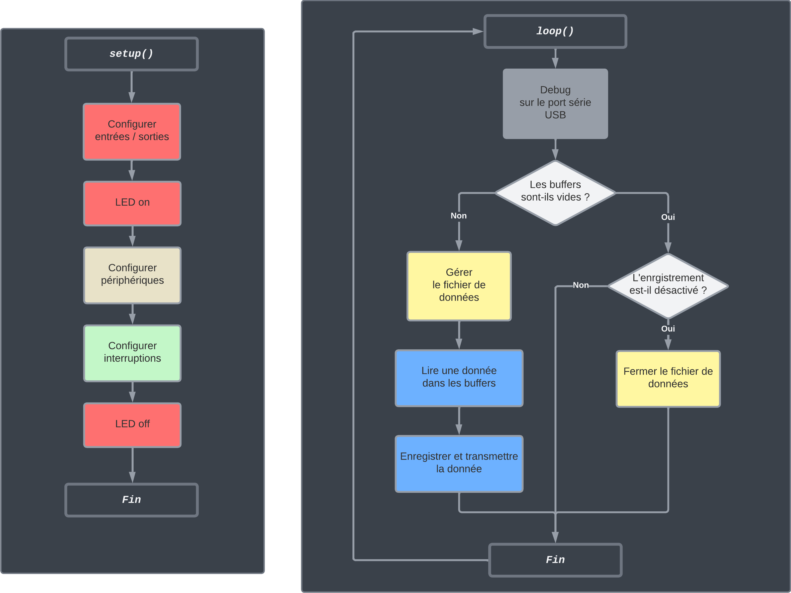

# MultiProbeCase

## Science Participative: vers un littoral connecté

Depuis une dizaine d’années, de nombreuses associations mettent en place des projets de sciences participatives. Le développement récent de capteurs à faibles coûts a permis le développement de nombreux projets de « kits de mesure » comme [SensoOcean](https://www.astrolabe-expeditions.org/programme-de-sciences/sensocean/), [SETIER Datalogger](https://gitlab.irstea.fr/reversaal/setier_datalogger), et [OceanIsOpen](https://github.com/TamataOcean/OceanIsOpen). Ces projets sont comparés dans la [synthèse de projets existants](docs/state_of_the_art.pdf), disponible dans la documentation.

Cette multiplication des points d’observations est une réelle opportunité pour mieux comprendre les phénomènes océaniques et littoraux, tout en limitant les coûts financiers et environnementaux associées à des missions océanographiques. Les laboratoires scientifiques se sont récemment saisis de cette thématique, et les journées [Ti’Low COAST](http://ti-low-coast.fr/?PagePrincipale) organisées en septembre à Brest ont permis de mettre en valeurs de nombreuses initiatives « low cost » portées par des laboratoires en France.

Dans le cadre local, les Pertuis Rochelais sont une zone d’étude privilégiée du laboratoire [LIENSs](https://lienss.univ-larochelle.fr/). Les chercheurs y étudient les caractéristiques physico-chimiques de l’eau et leur évolution, la dynamique sédimentaire ou le niveau de la mer... Une meilleure compréhension de cet environnement côtier variable nécessite plus de données, et actuellement une bouée scientifique permanente est en préparation.

Les voiliers, les navires à passagers ou les bateaux de courses ont accès à des zones différentes de celles explorées par nos navires de recherches. Intégrer un moyen de mesures autonome sur ces embarcations permettrait d’apporter des éléments de compréhension des dynamiques littorales en augmentant la résolution spatiale et temporelle des mesures actuelles.

L’objectif du projet « sciences participatives » est de développer un système de kits de mesure, dont le coût et la légèreté rendent possible son installation sur des navires d’opportunité. Ce prototype devrait intégrer des capteurs environnementaux (salinité, température, turbidité, O²) ainsi qu’un dispositif de mesure du niveau de la mer basé sur le système GNSS [Centipède](https://docs.centipede.fr/).


## Objectifs du projet

Ce projet s’articule autour de quatre thématiques principales :

 - La production de données environnementales dans les pertuis Rochelais; 
 - La mise à disposition et l’accès aux données; 
 - La maîtrise des coûts de mesure; 
 - L’évaluation des capteurs « low cost » du marché.

L’objectif principal du projet réside dans l’augmentation de la résolution saptiale et temporelle des données environnementales des pertuis. Pour cela, nous avons premièrement souhaité faciliter la prise de mesures sur le terrain en développant des kits de mesure pratiques et autonomes à embarquer à bord de bâteaux. Nous avons également eu recours à la science participative pour étendre les zones de mesures et augmenter la portée et la fréquence d’acquisition. 
Le système final sera destiné aux chercheurs, déjà familiers avec la prise de mesures, ainsi qu’à toute personne ou organisme n’ayant pas de connaissances ou compétences préalables, mais souhaitant tout de même participer à la collecte de données. Dans l’idéal, nous souhaiterions équiper un maximum d’embarcations. Les navires à passagers, traversant la zone plusieurs fois par jour, seront les principales cibles. Une fois le système en place, nous nous tournerons vers les plaisanciers et régatiers.

Une attention particulière est accordée à la mise à disposition et à l’accès aux données. Les principaux freins à celles-ci étant le transfert laborieux des mesures réalisées sur le terrain en base de données et la multiplication des plateformes de sockage en ligne. L’objectif sera donc d’automatiser le stockage des données et de les rendre facilement accèssibles.
La maîtrise des coûts de mesure participera également à faciliter la prise de mesures. Des équipements moins chers, mais qualifiés en précision, rebuteront moins les chercheurs et particuliers à l’achat et à l’utilisation dans des conditions difficiles.

La maîtrise des coûts passe par le développement de kits de mesure bien dimensionnés aux besoins. Une évaluation des capteurs « low cost » intéressants du marché est donc nécessaire, le but étant de déterminer leurs caratéristiques et tester leurs limites, afin de leur donner un contexte d’utilisation.

## Architecture système

Afin de répondre aux objectifs évoqués ci-dessus, un système de kits de mesure modulaire a été imaginé. Chaque kit a pour missions l'enregistrement de mesures de grandeurs définies, ainsi que le stockage local des données, afin de sécuriser l’acquisition. Ils sont également chargés de les transmettre en temps réel à une passerelle, s'occupant de centraliser leurs données et de les mettre à disposition. Par analogie avec les planètes et leurs satellites naturels, les kits de mesure ont été surnommés « satellites », puisqu’ils gravitent en quelque sorte autour de la passerelle.

## Architecture détaillée (Nouveau .md)
### Les satellites

Les satellites sont à la base de la chaîne d’acquisition. Ils constituent des solutions particulières, adaptées aux besoins des projets de recherche, pour générer des données. 
Leur rôle est d’enregistrer des mesures de grandeurs physiques, et de les communiquer à la passerelle. À noter qu’ils peuvent très bien fonctionner de manière isolée, sans cette dernière, et simplement enregister les données localement.

Malgré le nombre de projets rescencés (cf. [Cahier des Charges Foncionnel](docs/cdcf.pdf), nous avons pu regrouper les mesurandes apparaissant le plus souvent ensemble, et imaginer un nombre restreint de satellites. Pour le moment, Ils sont au nombre de trois : 

- Le satellite Cyclopée, chargé de la mesure de niveau marin;
- Deux versions d'une valise multicapteurs, chargées de relever les caractéristiques de l’eau.

##### Architecture et fonctionnement

###### Archtecture physique

Les satellites ont été conçus sur une base commune. Ils utilisent donc globalement les mêmes composants, et fonctionnent sur le même principe.

Le diagramme des flux suivant représente l'architecture des satellites. Le recepteur et l'antenne GNSS, ainsi que les capteurs changent en fonction du satellite désiré.


###### Architecture et fonctionnement logiciel

L’architecture logicielle repose sur celle d’un projet Arduino. Elle s’articule autour d’une fonction `setup()`, exécutée une seule fois au début du programme, et d’une boucle d’exécution `loop()`, appelée en continu et consitutant la base du programme. A ces fonctions, ont été ajoutées des interruptions périodiques permettant de répondre aux contraintes de temps réel des satellites. Les diagrammes suivant illustre l'organisation du fichier source.


L’architecture du programme étant maintenant fixée, nous allons pouvoir nous intéresser de plus près aux différentes tâches constituant le programme. Elles sont au nombre de cinq :

- Le démarrage;
- l’enregistrement et la transmission des données;
- La lecture des capteurs;
- La lecture/écriture des entrées/sorties;
- La mise à jour du temps UTC.

Le démarrage est réalisé par la fonction `setup() `d’Arduino. Elle permet de configurer le Teensy pour communiquer avec les périphériques du système. Les interruptions représentant les tâches liées aux capteurs, entrées/sorties et module GNSS, y sont configurées.

L’enregistrement et la transmission des données sont gérés par la fonction `loop()`, faisant office d’état de repos (idle) du système. La lecture des capteurs ne s’éffectuant pas dans cette boucle, des buffers ont été utilisés pour stocker temporairement les données à enregistrer. La fonction `loop()` se contente alors de lire les données des buffers, de gérer le fichier d’enregistrement, et d’y enregistrer les données. Cet état de repos est interrompu par les taches d’acquisition des périphériques, et entrées/sorties. Dans leur ordre de priorité, des interruptions ont donc été définies pour la lecture du temps UTC, la lecture/écriture des entrées/sorties, et la lecture des
capteurs.

Le module GNSS fournit au Teensy des trames NMEA contenant l’heure UTC et la position du système, en continu, à une fréquence choisie. Afin de correctement analyser ces trames, la bibliothèque utilisée nécéssite une fréquence de lecture du port série associé au module GNSS élevée (1kHz). L’interruption chargée de la lecture du port série a donc été définie comme prioritaire. 

Le rafraîchissement des sorties et la lecture des entrées ont volontairement été disociés de la boucle d’exécution afin de minimiser sa durée. De plus, l’interruption de lecture des capteurs a un temps d’exécution non négligeable, dû au délai de réponse des capteurs. Il peut arriver qu’à fréquence d’acquisition trop élevée, les appels à la lecture des capteurs s’accumulent. Le Teensy est alors trop occupé à résoudre ces appels et n’exécute jamais la fonction loop(). Le remède a été de définir une interruption prioritaire sur l’état de repos et la lecture des capteurs, permettant ainsi à l’utilisateur d’interagir avec le satellite malgré ce bloquage.

La lecture des capteurs a également été définie comme interruption périodique, afin de respecter précisément la fréquence d’acquisition. Sa durée d’exécution est conséquente, car elle dépend du temps de réponse des capteurs. Les données acquises sont temporairement stockées dans des buffers, servant la file d’attente pour enregistrement des données.

Les figures suivantes schématisent le déroulement du programme, et le chronogramme illsutre les priorités et la pile d’exécution des tâches.





###### Utilisation (Nouveau .md)

Concernant les sorties, une IHM rustique, mais fonctionnelle, a été implémentée à partir d’une
LED. Elle permet le monitoring du fonctionnement du satellite. Celle-ci consiste en une LED restant allumée pendant le démarrage, et clignotant à différentes fréquences pendant le fonctionnement. Au démarrage, si une condition nécéssaire au fonctionnement n’est pas satisfaite, cette LED reste indéfiniment allumée. Pendant le fonctionnement, un clignotement lent signifie que le satellite enregistre des données ; un clignotement intermédiare, que l’enregistrement est désactivé ; et un clignotement rapide, qu’un problème est apparu. A noter que certains problèmes, comme la déconnexion d’un capteur, ne sont détectés que si l’appareil enregistre. Une sortie
textuelle de débogage est également disponible sur le port série USB, et permet d’identifier les problèmes survenus. En entrée, seul un bouton permet d’activer/désactiver l’enregistrement. Ces états (LED et enregistrement) sont gérés par l’interruption de lecture/écriture des entrées/sorties.
La configuration des satellites passe, pour le moment, par la modification du code source. Pour
faciliter son utilisation, et minimiser les changements à effectuer, le programme a été conçu pour
être modulaire. La configuration du système (fréquence d’acquisition, segmentation des données,
etc.) s’effectue en tête du fichier, et le choix des capteurs, par l’inclusion des modules développés
pour ceux-ci. La Figure 5.5 illustre l’organisation du fichier source.
Des améliorations sont à prévoir comme l’endormissement du microcontrôleur, la modularisa-
tion des autres périphériques, ou le rassemblement des buffers en une seule classe. Des efforts
seront également menés pour affranchir l’utilisateur de la modification du code source. Nous
avons donc pensé à un fichier de configuration sur la carte SD, qui sera lu à chaque démarrage
du système, plutôt que de devoir téléverser un nouveau programme à chaque modification. L’ob-
jectif final est d’éliminer toute différence logicielle entre les satellites, et d’obtenir un kit flexible,
capable d’héberger n’importe lequel d’entre eux, voire y connecter un jeu de sondes personnalisé.
La réception d’ordres de la passerelle doit également encore être implémentée pour permettre le
contrôle du système à distance.

##### Le satellite Cyclopée
La détermination du niveau marin par Cyclopée consiste en la mesure du tirant d’air le séparant de la surface de l’eau, et du calcul précis de sa position GNSS. Ce principe développé et validé par [Chupin et al. (2020)](https://doi.org/10.3390/rs12162656) permet, à partir des données recueillies de calculer le niveau marin.


##### La valise multicapteurs
La valise multicapteurs est destinée à la mesure de plusieurs grandeurs. Elle embarquera donc différentes sondes. Pour répondre aux besoins du laboratoire (cf. [Cahier des Charges Fonctionnel](docs/cdcf.pdf) de la documentation), elle a principalement été développée pour le suivi de la qualité de l’eau.

Deux versions ont été réalisées :

- Une plus bon marché, chargée des caractéristiques simples comme la température, la turbidité et la salinité; 
- Une plus onéreuse, prévue pour les grandeurs plus complexes comme les concentrations en oxygène, chlorophylle et le pH.

Le système se veut modulaire et assez flexible pour accepter des versions modifiées de ces satellites, ou bien de nouveaux n’ayant pas encore été imaginés.

Les carartéristques et fonctionnement des satellites sont respectivement abordés plus en détail dans le [Cahier des Charges Fonctionnel](docs/cdcf.pdf) de la documentation, et dans leurs dossiers repectif terminant par ```..._sat```.

### La passerelle
La passerelle, de son côté, constitue l’élément central du système. C’est elle qui réalise le pont entre les données et les utilisateurs finaux. Elle enregistre les données des satellites en base de données, d’abord localement, puis les décharge sur un serveur distant connecté à internet, pour les rendre accessibles à la communauté de chercheurs.

### Architecture détaillée

Le diagramme de flux de la figure suivante représente l’architecture du système satellites / passerelle. 


-------------------------------------------------------
