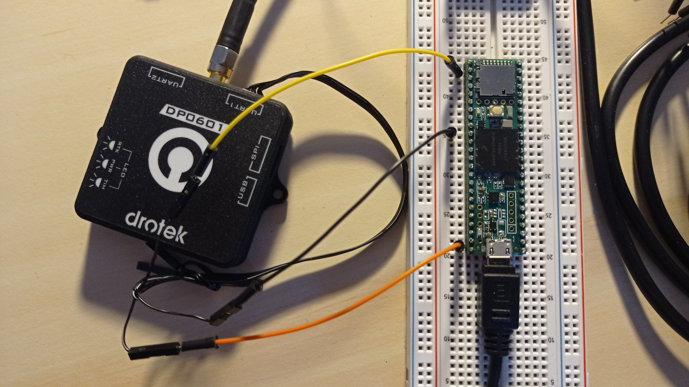

Test de réception du temps GNSS
===============================

## En bref
Ce programme permet de tester la réception du temps GNSS communiqué par un récepteur GNSS via les trames NMEA `$GPGGA` et `$GPRMC`.

## Matériel
- Teensy 3.5;
- Drotek DP0601 RTK GNSS (XL F9P)

## Bibliothèque
- `TinyGPSPlus`.

## Inspiration
Ce programme est inspiré des exemples présents sur le site [Arduiniana](http://arduiniana.org/libraries/tinygpsplus/).

## Ports
Pour ce montage, le port de communication `Serial` est utilisé pour le debug via USB (moniteur série de l'IDE Arduino) à 115200 baud.  
Le récepteur Drotek DP0601 a été configuré pour diffuser les trames NMEA `$GPGGA` et `$GPRMC` sur son port `UART1`. 
Le Teensy utilisera son port `Serial5` pour recevoir les trames NMEA du récepteur Drotek.

## Branchements

Le montage conciste simplement à connecter le port série `Serial5` du Teensy au port série `UART1` du recepteur Drotek.

|Teensy|DP0601|
|------|------|
|RX5|UART1 B3 (TX)|
|Vin (5V)|UART1 B1 (5V)|
|GND|UART1 B6 (Gnd)|

