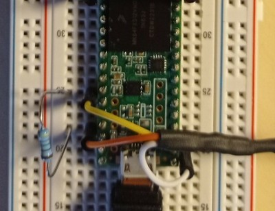

Test de lecture de la température
================================

## En bref
Ce programme lit sur un bus OneWire la valeur de la température mesurée par une sonde DS18B20.

## Matériel
- Teensy 3.5 ou carte ESP32;
- Sonde de température DS18B20;
- Résistance pull up 4.7kOhms.

## Bibliothèques
- `OneWire`;
- `DallasTemperature`.

## Inspiration
Ce programme s'inspire de l'exemple de lecture de température `Simple.ino` fourni par DallasTemperature dans sa bibliothèque `DallasTemperature`.

## Montage

|Carte électronique|DS18B20|
|------|-------|
|3V3|Fil Orange|
|GND|Fil Blanc|
|Entrée digitale|Fil Jaune|

L'entrée digitale est paramétrable dans le code source de l'exemple.

La résistance doit être montée en parallèle des fils Orange et Jaune du DS18B20.

Exemple de montage sur le Teensy 3.5 :

